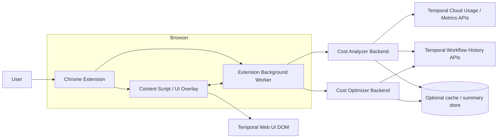

# Temporal Cost Optimizer

Temporal Cost Optimizer is a hackathon MVP for surfacing Temporal Cloud usage hotspots. It pairs a Chrome extension overlay with Go backend services that rank namespaces, prepare workflow drilldowns, and expose optimization analysis endpoints.

> **Important Temporal Cloud API limitation:** Temporal Cloud APIs do not currently allow reading workflow and execution data directly from a namespace. Namespaces that require mTLS authentication also are not supported by this demo.

## Architecture



## Backend

Create a local `.env` file:

```sh
cp .env.example .env
```

The backend currently runs in generated sample-data mode, so local demo API requests do not call Temporal Cloud. The Temporal Cloud SDK integration remains in the codebase for future use, but it is not wired into the default API server.

Run the API server:

```sh
go run ./cmd/api
```

The server reads configuration from `.env` in the current working directory and listens on `:8080` by default. Override it in `.env` with:

```dotenv
HTTP_ADDR=:9090
```

Run with Docker Compose:

```sh
docker compose up --build backend
```

The compose service mounts `./.env` into the container at `/app/.env` and maps host port `8080` to the backend. Keep `HTTP_ADDR=:8080` when using the default compose port mapping.

## Environment

Default API responses are generated in-process on each request. Temporal Cloud usage access through the experimental Temporal Cloud Go SDK remains available in `internal/temporalcloud` and the Temporal-backed analyzer/optimizer packages, but it is not used by `cmd/api` while sample-data mode is wired in.

Supported `.env` variables:

- `HTTP_ADDR`
- `TEMPORAL_CLOUD_USAGE_API_KEY`
- `TEMPORAL_CLOUD_NAMESPACE_API_KEY`
- `TEMPORAL_CLOUD_API_HOST_PORT`
- `TEMPORAL_CLOUD_API_VERSION`
- `TEMPORAL_USAGE_PAGE_SIZE`

All API endpoints below return randomized sample data today. `GET /workflows/{workflowId}/optimize?namespace={namespace}` returns sample optimization findings for the requested workflow ID without calling Temporal Cloud.

## API Surface

- `GET /healthz`
- `GET /namespaces?top=5`
- `GET /namespaces/{name}/workflow-types?top=5`
- `GET /workflow-types/{workflowType}/usage?namespace={name}`
- `GET /workflows/{workflowId}/optimize?namespace={namespace}`

Run tests:

```sh
go test ./...
```

Run local sanity API checks against a running backend:

```sh
bash scripts/sanity-api.sh
```

Optional overrides: `BASE_URL`, `NAMESPACE`, `WORKFLOW_TYPE`, `WORKFLOW_ID`.
