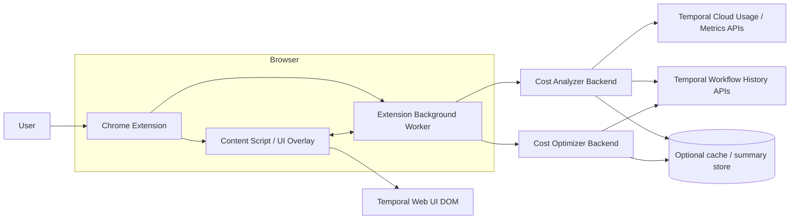

# Temporal Cost Optimizer

Temporal Cost Optimizer is a hackathon MVP for surfacing Temporal Cloud usage hotspots. It pairs a Chrome extension overlay with Go backend services that rank namespaces, prepare workflow drilldowns, and expose optimization analysis endpoints.

## Architecture



## Backend

Create a local `.env` file:

```sh
cp .env.example .env
```

Set `TEMPORAL_CLOUD_API_KEY` in `.env` before starting the server. The backend requires a real Temporal Cloud API key because it creates the SDK client during startup.

Run the API server:

```sh
go run ./cmd/api
```

The server reads configuration from `.env` in the current working directory and listens on `:8080` by default. Override it in `.env` with:

```dotenv
HTTP_ADDR=:9090
```

Run with Docker Compose:

```sh
docker compose up --build backend
```

The compose service mounts `./.env` into the container at `/app/.env` and maps host port `8080` to the backend. Keep `HTTP_ADDR=:8080` when using the default compose port mapping.

## Environment

Temporal Cloud usage is accessed through the experimental Temporal Cloud Go SDK and is intentionally limited to the Cloud Usage API summary records from `temporal/api/cloud/usage/v1/message.proto`.
Workflow execution analysis resolves the namespace's workflow gRPC endpoint from Cloud Ops namespace metadata before calling the Temporal Workflow Service API.

Supported `.env` variables:

- `HTTP_ADDR`
- `TEMPORAL_CLOUD_API_KEY`
- `TEMPORAL_CLOUD_API_HOST_PORT`
- `TEMPORAL_CLOUD_API_VERSION`
- `TEMPORAL_USAGE_PAGE_SIZE`

Only `GET /namespaces?top=5` is backed by Temporal Cloud usage data today. Workflow-type drilldown still returns `501 Not Implemented` because the Usage API groups records by namespace only.

`GET /workflows/{workflowId}/analyze?namespace={namespace}` fetches the latest completed run for that workflow ID in the namespace and returns heuristic optimization findings. The backend discovers the namespace workflow endpoint through the Cloud Ops API.

## API Surface

- `GET /healthz`
- `GET /namespaces?top=5`
- `GET /namespaces/{name}/workflow-types?top=5`
- `GET /workflow-types/{workflowType}/usage?namespace={name}`
- `GET /workflows/{workflowId}/analyze?namespace={namespace}`

Run tests:

```sh
go test ./...
```

Run local sanity API checks against a running backend:

```sh
bash scripts/sanity-api.sh
```

Optional overrides: `BASE_URL`, `NAMESPACE`, `WORKFLOW_TYPE`, `WORKFLOW_ID`.
