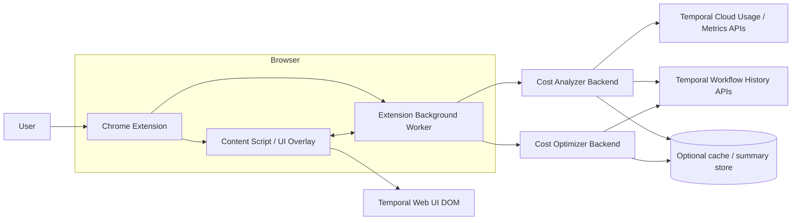
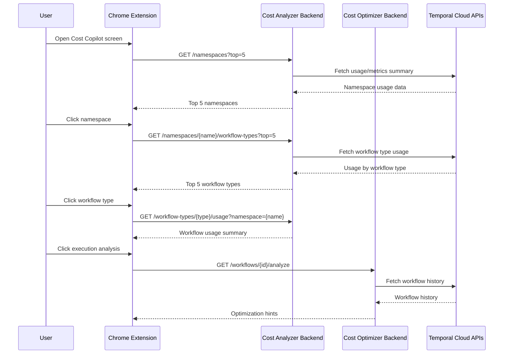
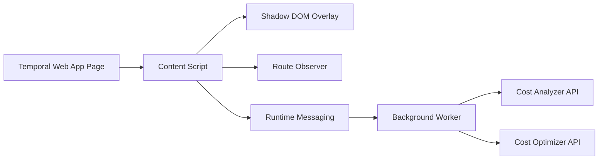

# Temporal Cost Copilot — MVP High-Level Design

## 1. Overview

This MVP is a **Chrome extension + backend services** that surfaces **cost and usage hotspots** in Temporal Cloud and helps users identify the most expensive **namespaces**, **workflow types**, and **individual workflow executions**.

The core UX is an overlay added to the Temporal UI:

- a new sidebar entry that opens the Cost Copilot screen
- a **Top 5 namespaces** view
- a **Top 5 workflow types** view inside a selected namespace
- a **Workflow usage / analysis** view for a selected workflow execution or workflow type


---

## 2. Goals

### User goals

- Identify where Temporal usage is concentrated.
- Understand the primary cost drivers.
- See concrete optimization suggestions.
- Move from aggregate cost view to workflow-level explanation quickly.

### MVP goals

- Show top 5 namespaces by usage/cost.
- Show top 5 workflow types inside a namespace.
- Show workflow usage details.
- Analyze one workflow execution and return optimization hints.
- Render these insights in an extension UI layered on top of Temporal.

### Non-goals for MVP

- Exact bill attribution per single workflow execution.
- Automatic code changes or auto-fixes.
- Continuous background monitoring.
- Multi-account / multi-tenant admin workflows.

---

## 3. Assumptions

- Temporal Cloud usage and metrics data can be accessed using the Cloud APIs and/or OpenMetrics endpoints.
- Workflow history can be fetched for a selected execution.
- The extension runs in the browser where the user is already logged into Temporal Cloud.
- The UI is primarily a read-only overlay, not a replacement for Temporal UI.

---

## 4. System Architecture



### Key responsibilities

**Chrome extension**

- injects a new side navigation entry
- renders pages/panels for namespace and workflow insights
- renders panels and insights inside the Temporal UI
- calls backend APIs through the extension background worker

**Cost analyzer backend**

- aggregates usage by namespace and workflow type
- returns ranked lists and drill-down summaries
- computes the internal `usageScore` ranking metric

**Cost optimizer backend**

- fetches workflow history for a selected execution
- runs heuristic analysis
- returns optimization hints

---

## 5. UX / Screen Flow

### Screens

#### 5.1 Top 5 namespaces view

Each row shows:

- namespace name
- usage rank
- estimated cost / usage volume
- trend indicator - best effort


Clicking a namespace opens the namespace detail screen.

#### 5.2 Top 5 workflow types in namespace

Each row shows:

- workflow type name
- usage share
- billable action estimate
- signal count / activity count estimate


Clicking a workflow type opens the usage screen.

#### 5.3 Workflow usage view

Shows:

- total usage estimate
- billable action summary
- history size / event count
- recent executions
- optimization hints

#### 5.4 Workflow execution analysis

Shows:

- large payload warnings
- excessive signal warnings
- redundant activity warnings
- suggested remediation

---

## 6. Data Flow



---

## 7. Backend Services

## 7.1 Cost Analyzer Backend

### Purpose

Provide ranked usage views and drill-down summaries.

### Suggested APIs

#### `GET /namespaces?top=5`

Returns the top namespaces by estimated usage or cost.

Response example:

```json
{
  "items": [
    {
      "namespace": "payments-prod",
      "rank": 1,
      "usageScore": 98342,
      "estimatedCost": 124.55,
      "storage": {
        "active": {
          "usage": 1200,
          "cost": 80.25
        },
        "retained": {
          "usage": 3400,
          "cost": 44.30
        }
      },
      "trend": "up",
      
    }
  ]
}
```

#### `GET /namespaces/{name}/workflow-types?top=5`

Returns top workflow types in the selected namespace.

Response example:

```json
{
  "namespace": "payments-prod",
  "items": [
    {
      "workflowType": "ChargeCardWorkflow",
      "usageScore": 44100,
      "estimatedCost": 54.2,
      "storage": {
        "active": {
          "usage": 600,
          "cost": 35.10
        },
        "retained": {
          "usage": 1800,
          "cost": 19.10
        }
      },
      "signals": 220,
      "activities": 910
    }
  ]
}
```

#### `GET /workflow-types/{workflowType}/usage?namespace={name}`

Returns a usage summary for the selected workflow type.
`namespace` is required because workflow type names are only unique within a namespace.

Response example:

```json
{
  "workflowType": "ChargeCardWorkflow",
  "namespace": "payments-prod",
  "summary": {
    "storage": {
      "active": {
        "usage": 320,
        "cost": 18.4
      },
      "retained": {
        "usage": 950,
        "cost": 9.7
      }
    },
    "executions": 182,
    "billableActions": 9100,
    "avgHistoryEvents": 144,
    "p95HistoryEvents": 302
  }
}
```

### Implementation note

For the MVP, it is cleaner to use **workflow type** as the primary drill-down dimension rather than trying to infer exact per-run cost from list pages alone.

`usageScore` is an internal composite ranking metric used only for sorting and comparison. It is not a billable value. A simple MVP formula is:

`usageScore = w1 * billableActions + w2 * activeStorageUsage + w3 * retainedStorageUsage + w4 * executions`

The weights can be tuned for demo purposes and do not need to be exposed in the UI.

---

## 7.2 Cost Optimizer Backend

### Purpose

Analyze only the last completed workflow execution and generate actionable optimization hints.

### Suggested API

#### `GET /workflows/{workflowId}/analyze`

Returns heuristic findings for the last completed workflow execution only. The backend must ignore running or in-flight executions and analyze the most recent completed run.

Response example:

```json
{
  "workflowId": "abc123",
  "workflowRunId": "abc123-run-20260505-001",
  "signals": [
    {
      "type": "large_payload",
      "severity": "high",
      "evidence": "3 events exceed payload threshold"
    },
    {
      "type": "excessive_signals",
      "severity": "medium",
      "evidence": "18 signals in one execution"
    }
  ],
  "recommendations": [
    "Compress large payloads before storing them in workflow state.",
    "Batch signals where possible.",
    "Deduplicate repeated activities using memoization or cached results."
  ]
}
```

### Heuristic rules for MVP

- **Large payloads**: payload size above threshold
- **Excessive signals**: signal count above threshold
- **Redundant activities**: repeated activity name + input patterns
- **History bloat**: unusually high event count

Only the last completed run is analyzed for these signals.

---

## 8. Extension Architecture



### Extension pieces

#### Content script

- detects Temporal UI pages
- injects the sidebar button and overlay container
- renders panels
- listens for navigation changes in the single-page app

#### Background worker

- handles network requests
- stores auth/session state as needed
- normalizes API responses


#### UI layer

- build with React or vanilla TS
- mount inside Shadow DOM to avoid CSS collisions
- use local routing for the extension screens

---

## 9. Data Model

### NamespaceSummary

- namespace
- usageScore: internal composite ranking metric
- estimatedCost
- trend
- storage (active, retained)

### WorkflowTypeSummary

- namespace
- workflowType
- usageScore: internal composite ranking metric
- estimatedCost
- storage (active, retained)
- executions
- signals
- activities

### WorkflowUsageSummary

- workflowType
- executions
- billableActions
- storage (active, retained)
- averageHistoryEvents
- p95HistoryEvents

### AnalysisFinding

- type
- severity
- evidence
- recommendation

---

## 10. API and Security Considerations

- Use Temporal Cloud credentials only in backend services, not in the browser extension.
- Keep the extension as a thin UI client.
- Restrict backend access by user/session or signed token.

- Treat usage estimates as estimates, not exact invoices.

---

## 11. Non-Functional Requirements

### Performance

- namespace ranking should load in under a few seconds for demo-scale data
- workflow analysis should return quickly for a single execution


### Reliability

- fail gracefully if usage APIs are unavailable
- show partial data instead of blocking the UI

### Security

- do not expose cloud API keys to the client
- isolate extension UI from page CSS and scripts

### Maintainability

- keep heuristic rules in one module
- keep API response shapes stable and versioned

---

## 12. Risks and Mitigations

### Risk: exact cost attribution is hard

**Mitigation:** use usage estimates and workflow type aggregates for MVP.

### Risk: Temporal UI changes break the extension

**Mitigation:** use resilient selectors and route observers; keep all DOM injection isolated.

### Risk: workflow history analysis can become expensive

**Mitigation:** analyze only the selected execution and cache summaries.

### Risk: usage metrics and workflow history may not align perfectly

**Mitigation:** label metrics as estimates and explain the source of each value.

---

## 13. MVP Demo Script

1. Open Temporal UI.
2. Click the Cost Copilot sidebar button.
3. Show the **Top 5 namespaces** screen.
4. Click a namespace.
5. Show the **Top 5 workflow types** screen.
6. Click a workflow type.
7. Show usage summary.
8. Click a specific execution.
9. Show heuristic findings and recommendations.
10. Show optimization insights directly in the Temporal UI.

---

## 14. Recommended MVP Scope

### Must have

- extension sidebar entry
- top 5 namespace ranking
- namespace drill-down to top 5 workflow types
- workflow type usage screen
- single execution analysis
- 3 heuristic findings

### Nice to have


- trend charts

- export/share view

---

## 15. Final Recommendation

For the hackathon, keep the system centered on **workflow types** rather than trying to build precise per-workflow cost accounting from the start. That gives you a credible product story, a believable technical implementation, and a fast path to demo value.


